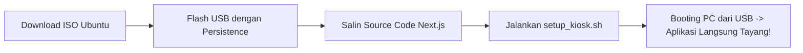

# 🚀 Panduan Lengkap: Membuat Ubuntu USB Boot Kiosk dengan Next.js & Multi-Tema

Panduan ini memandu Anda langkah demi langkah membuat **Flashdisk USB Bootable Ubuntu** yang ketika dicolokkan ke PC/Laptop manapun dan dinyalakan, akan **langsung otomatis membuka aplikasi Next.js Anda secara Fullscreen (Mode Kiosk)** dengan fitur ganti-ganti tema yang tersimpan secara permanen (*persistent*).

---

## 📋 Ringkasan Alur Kerja



---

## 🛠️ Alat & Bahan yang Dibutuhkan

1. **Flashdisk USB** minimal 8 GB atau 16 GB (Direkomendasikan USB 3.0 / 3.1 / 3.2 untuk kecepatan boot maksimal).
2. **ISO Ubuntu**:
   - Pilihan 1: **Ubuntu Desktop 24.04 LTS** (Cocok untuk kompatibilitas driver terlengkap).
   - Pilihan 2: **Xubuntu Minimal / Lubuntu** (Sangat ringan, boot hanya 3-5 detik).
3. **Software Pembuat Bootable**:
   - **Rufus** (Untuk pengguna Windows).
   - **Ventoy** (Mendukung multi-ISO + persistence plugin).
   - **mkusb** (Untuk pengguna Linux).

---

## 📝 Langkah 1: Flash Ubuntu ke USB dengan Fitur "Persistence"

> [!IMPORTANT]
> **PENTING: Fitur Persistence Wajib Diaktifkan!**
> Jika Live USB dibuat biasa (tanpa persistence), maka semua perubahan (instalasi Node.js, tema yang diganti pengguna, dan file aplikasi) akan hilang setiap kali komputer dimatikan.

### Menggunakan Rufus di Windows:
1. Pasang Flashdisk USB ke komputer.
2. Buka **Rufus**.
3. Pilih perangkat USB Anda pada bagian **Device**.
4. Klik **SELECT** dan pilih file ISO Ubuntu yang telah diunduh.
5. Pada bagian **Persistent partition size**, geser slider ke kanan (berikan alokasi sekitar **4 GB s/d 10 GB**).
6. Skema Partisi: **GPT** (Target system: **UEFI (non CSM)**).
7. Klik **START** dan tunggu hingga proses pembuatan flashdisk selesai.

---

## 📁 Langkah 2: Memasukkan Aplikasi Next.js ke Dalam USB

1. Nyalakan PC dan masuk ke **Boot Menu** (biasanya tekan tombol `F12`, `F8`, `F11`, atau `Esc` saat logo merk PC muncul).
2. Pilih Boot dari Flashdisk USB Anda.
3. Pilih menu **Try Ubuntu** (Jangan pilih Install).
4. Buka **Terminal** di Ubuntu Live (`Ctrl + Alt + T`).
5. Salin folder projek ini `app_boot` ke direktori user:
   ```bash
   sudo mkdir -p /home/kiosk/app_boot
   # Salin seluruh isi source code ke direktori tersebut
   ```

---

## ⚙️ Langkah 3: Menjalankan Skrip Otomatis Kiosk

Jalankan perintah ini di terminal Ubuntu Live USB:

```bash
cd /home/kiosk/app_boot/scripts
chmod +x setup_kiosk.sh
sudo ./setup_kiosk.sh
```

Skrip ini akan secara otomatis:
1. Menginstal Node.js, Chromium Browser, dan Openbox Window Manager.
2. Mengonfigurasi **Auto-Login** tanpa password untuk user `kiosk`.
3. Mengompilasi Next.js (`npm run build`) untuk performa tinggi.
4. Membuat **Systemd Service** (`nextjs-kiosk.service`) agar server Next.js otomatis berjalan di background saat sistem boot.
5. Mengatur **Chromium Kiosk Autostart** dengan parameter fullscreen tanpa address bar.

---

## 🎨 Fitur Multi-Tema & Penyimpanan Persistence

Aplikasi Next.js ini dilengkapi dengan 8 tema futuristik & modern:
1. **Cyberpunk Neon** (Cyan & Magenta Glow)
2. **Midnight OLED** (Pure True Black & Emerald)
3. **Tokyo Sunset** (Synthwave Violet & Warm Pink)
4. **Nordic Arctic** (Deep Navy & Ice Cyan)
5. **Matrix Terminal** (Retro CRT Phosphor Green & Scanlines)
6. **Daylight Modern** (Clean Light Mode & Sapphire Indigo)
7. **Crimson Ember** (Volcanic Magma & Ruby)
8. **Emerald Aurora** (Deep Jade & Bioluminescent Mint)

### Cara Ganti Tema:
- **Shortcut Keyboard**: Tekan `Ctrl + T` atau `Alt + T` untuk beralih tema secara instan.
- **Tombol Navigasi**: Klik tombol Tema di bar atas atau buka tab **Studio & Tema**.
- **CLI Terminal**: Ketik `theme set oled` atau `theme set matrix` di Terminal Console bawaan aplikasi!

Tema yang dipilih disimpan di `localStorage` browser dan partisi persistent USB, sehingga tema Anda tetap sama saat PC dimatikan dan dinyalakan kembali!

---

## ⌨️ Shortcut Keyboard Kiosk

| Tombol | Fungsi |
|---|---|
| `F11` | Masuk / Keluar Layar Penuh (Fullscreen) |
| `Ctrl + T` | Ganti Tema Selanjutnya (Cycle Themes) |
| `Ctrl + \`` | Buka Terminal CLI Sandbox |
| `Esc` | Tutup Modal / Dialog Aktif |

---

## 🔧 Troubleshooting & Tips

> [!TIP]
> **Resolusi Layar**: Jika monitor kiosk memiliki resolusi khusus (misal 1366x768 atau 4K), Chromium akan otomatis menyesuaikan skala dengan CSS responsive flexbox.
> 
> **Mencegah Layar Blank / Sleep**: Skrip autostart telah menonaktifkan DPMS dan screensaver secara otomatis (`xset -dpms s off`).
